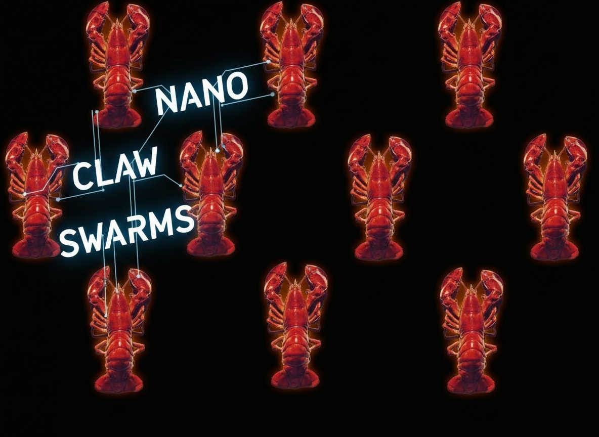

<p align="center">
  
</p>

<h1 align="center">🦞 Nano Claw Swarms</h1>

<p align="center">
  <strong>Multi-agent AI orchestration platform with swarm intelligence</strong>
</p>

<p align="center">
  <a href="#features">Features</a> •
  <a href="#architecture">Architecture</a> •
  <a href="#getting-started">Getting Started</a> •
  <a href="#database-schema">Schema</a> •
  <a href="#rbac">RBAC</a> •
  <a href="#api">API</a> •
  <a href="#deployment">Deployment</a> •
  <a href="#license">License</a>
</p>

---

## Overview

**Nano Claw Swarms** is a production-ready multi-agent workflow orchestration platform. It enables teams to design, execute, and monitor AI agent swarms — coordinated groups of LLM-powered agents that collaborate to solve complex tasks. Built with multi-tenancy, role-based access control, and real-time observability from the ground up.

Inspired by and built upon the [Swarms](https://github.com/kyegomez/swarms) framework by Kye Gomez.

---

## Features

### 🤖 Agent Management
- Define agents with custom system prompts, model providers, temperature, and loop limits
- Support for multiple LLM providers (OpenAI, Anthropic, Google, etc.)
- Per-agent configuration scoped to organizations

### 🔄 Workflow Orchestration
- **Sequential Workflows** — agents execute in order, passing context forward
- **Parallel Workflows** — agents run concurrently with result aggregation
- Visual workflow designer with step-by-step configuration
- Workflow versioning and org-scoped isolation

### 📊 Run Monitoring & Observability
- Real-time run tracking with status (`running`, `completed`, `failed`)
- Granular event stream per run (`agent_start`, `agent_complete`, `agent_error`, `workflow_complete`)
- Structured logging with level filtering (`info`, `warn`, `error`, `debug`)
- Token usage tracking and cost attribution
- Full input/output capture for every agent execution

### 🏢 Multi-Tenant Organizations
- Create and manage multiple organizations
- Invite team members with role-based permissions
- All data (agents, workflows, runs, logs, secrets) is strictly org-scoped
- Seamless org switching in the console UI

### 🔐 Role-Based Access Control (RBAC)
Four-tier permission model enforced at the database level:

| Role | View | Create/Edit | Delete | Manage Members | Manage Settings |
|------|------|-------------|--------|----------------|-----------------|
| **Owner** | ✅ | ✅ | ✅ | ✅ | ✅ |
| **Admin** | ✅ | ✅ | ✅ | ✅ | ❌ |
| **Member** | ✅ | ✅ | ❌ | ❌ | ❌ |
| **Viewer** | ✅ | ❌ | ❌ | ❌ | ❌ |

### 🔑 Provider Key Vault
- Encrypted storage for LLM API keys
- Org-scoped key management
- Support for multiple providers per organization

---

## Architecture

```
┌─────────────────────────────────────────────────────┐
│                   Frontend (React)                   │
│  ┌──────────┐ ┌──────────┐ ┌──────────┐ ┌────────┐ │
│  │  Agents  │ │Workflows │ │   Runs   │ │  Logs  │ │
│  └────┬─────┘ └────┬─────┘ └────┬─────┘ └───┬────┘ │
│       │             │            │            │      │
│  ┌────┴─────────────┴────────────┴────────────┴──┐  │
│  │              OrgContext (RBAC)                  │  │
│  └────────────────────┬──────────────────────────┘  │
└───────────────────────┼─────────────────────────────┘
                        │
                        ▼
┌───────────────────────────────────────────────────────┐
│                 Lovable Cloud Backend                  │
│  ┌─────────────┐  ┌──────────────┐  ┌──────────────┐ │
│  │  Auth (JWT)  │  │  PostgreSQL   │  │Edge Functions│ │
│  │  + RLS       │  │  + RLS        │  │              │ │
│  └──────────────┘  └──────────────┘  └──────────────┘ │
└───────────────────────────────────────────────────────┘
```

### Tech Stack

| Layer | Technology |
|-------|-----------|
| **UI Framework** | React 18 + TypeScript |
| **Build Tool** | Vite |
| **Styling** | Tailwind CSS + shadcn/ui |
| **Animations** | Framer Motion |
| **Routing** | React Router v6 |
| **State** | TanStack Query (React Query) |
| **Backend** | Lovable Cloud (PostgreSQL + Edge Functions) |
| **Auth** | JWT-based with email verification |

---

## Getting Started

### Prerequisites

- Node.js 18+ (recommended: use [nvm](https://github.com/nvm-sh/nvm))
- npm or bun

### Installation

```bash
# Clone the repository
git clone <YOUR_GIT_URL>
cd nano-claw-swarms

# Install dependencies
npm install

# Start development server
npm run dev
```

The app will be available at `http://localhost:5173`.

### Environment Variables

The following environment variables are auto-configured:

| Variable | Description |
|----------|-------------|
| `VITE_SUPABASE_URL` | Backend API endpoint |
| `VITE_SUPABASE_PUBLISHABLE_KEY` | Public API key |
| `VITE_SUPABASE_PROJECT_ID` | Project identifier |

---

## Database Schema

### Entity Relationship Diagram

```
┌──────────┐     ┌─────────────┐     ┌──────────┐
│   orgs   │────<│ org_members  │>────│  users   │
│          │     │  (role enum) │     │  (auth)  │
└────┬─────┘     └─────────────┘     └──────────┘
     │
     │ org_id (FK on all tables below)
     │
     ├──────────────┬───────────────┬──────────────┬──────────────┐
     ▼              ▼               ▼              ▼              ▼
┌─────────┐  ┌───────────┐  ┌──────────┐  ┌──────────┐  ┌──────────────┐
│ agents  │  │ workflows │  │   runs   │  │   logs   │  │provider_keys │
│         │  │           │──│          │  │          │  │              │
└─────────┘  └───────────┘  └────┬─────┘  └──────────┘  └──────────────┘
                                 │
                                 ▼
                          ┌─────────────┐
                          │ run_events  │
                          └─────────────┘
```

### Tables

| Table | Purpose | Key Columns |
|-------|---------|-------------|
| `orgs` | Organizations/teams | `id`, `name`, `created_by` |
| `org_members` | Membership + roles | `org_id`, `user_id`, `role` |
| `agents` | AI agent definitions | `name`, `model_provider`, `model_name`, `system_prompt`, `temperature`, `max_loops` |
| `workflows` | Multi-agent pipelines | `name`, `workflow_type`, `steps` (JSONB) |
| `runs` | Workflow executions | `workflow_id`, `status`, `input`, `output`, `tokens_used` |
| `run_events` | Granular execution events | `run_id`, `event_type`, `agent_name`, `data` |
| `logs` | Structured application logs | `level`, `message`, `metadata`, `run_id` |
| `provider_keys` | Encrypted API keys | `provider`, `encrypted_key`, `name` |

### Security Functions

```sql
-- Check if user is a member of an org
is_org_member(user_id, org_id) → boolean

-- Check if user has a specific role
has_org_role(user_id, org_id, role) → boolean

-- Check if user has a role >= minimum (owner > admin > member > viewer)
has_org_role_gte(user_id, org_id, min_role) → boolean
```

All RLS policies use `SECURITY DEFINER` functions to enforce org-scoped data isolation.

---

## RBAC

### How It Works

1. **Database-level enforcement**: Every table with `org_id` has RLS policies that call `is_org_member()` or `has_org_role_gte()`.
2. **Frontend enforcement**: `OrgContext` exposes the current user's role, and UI components conditionally render actions based on permissions.
3. **Edge function enforcement**: The `run-workflow` function validates org membership before executing.

### Role Hierarchy

```
Owner (4) > Admin (3) > Member (2) > Viewer (1)
```

`has_org_role_gte('member', org_id, user_id)` returns `true` for Member, Admin, and Owner.

---

## API

### Edge Functions

#### `POST /run-workflow`

Execute a workflow with the given input.

**Request Body:**
```json
{
  "workflowId": "uuid",
  "input": "Analyze this dataset...",
  "orgId": "uuid"
}
```

**Response:**
```json
{
  "runId": "uuid",
  "status": "running"
}
```

---

## Project Structure

```
├── public/
│   ├── favicon.jpg
│   └── images/
├── src/
│   ├── assets/              # Static assets (images, etc.)
│   ├── components/
│   │   ├── ui/              # shadcn/ui primitives
│   │   ├── ConsoleLayout.tsx # Dashboard shell + org switcher
│   │   └── NavLink.tsx
│   ├── contexts/
│   │   └── OrgContext.tsx    # Org state + RBAC hooks
│   ├── hooks/
│   ├── integrations/
│   │   └── supabase/        # Auto-generated client + types
│   ├── pages/
│   │   ├── Auth.tsx          # Sign in / Sign up
│   │   ├── Index.tsx         # Landing page
│   │   ├── About.tsx         # Attribution page
│   │   └── console/
│   │       ├── Overview.tsx
│   │       ├── Agents.tsx
│   │       ├── Workflows.tsx
│   │       ├── Runs.tsx
│   │       ├── Logs.tsx
│   │       ├── Secrets.tsx
│   │       └── Settings.tsx
│   └── lib/
│       └── utils.ts
├── supabase/
│   ├── config.toml
│   ├── migrations/          # Database migrations
│   └── functions/
│       └── run-workflow/     # Workflow execution engine
└── README.md
```

---

## Deployment

### Via Lovable

1. Open the project in [Lovable](https://lovable.dev)
2. Click **Share → Publish**
3. Optionally connect a [custom domain](https://docs.lovable.dev/features/custom-domain)

### Manual

```bash
npm run build
# Deploy the `dist/` folder to any static hosting provider
```

---

## Testing

```bash
# Run unit tests
npm run test
```

---

## Contributing

1. Fork the repository
2. Create a feature branch (`git checkout -b feature/my-feature`)
3. Commit your changes (`git commit -m 'Add my feature'`)
4. Push to the branch (`git push origin feature/my-feature`)
5. Open a Pull Request

---

## Open Source Attribution

This project is built upon and inspired by the [Swarms](https://github.com/kyegomez/swarms) framework by [Kye Gomez](https://github.com/kyegomez), licensed under the Apache License 2.0.

See the [NOTICE](NOTICE) file for full attribution details.

---

## License

Licensed under the **Apache License 2.0**. See [LICENSE](LICENSE) for the full text.

```
Copyright 2025 Nano Claw Swarms Contributors

Licensed under the Apache License, Version 2.0 (the "License");
you may not use this file except in compliance with the License.
You may obtain a copy of the License at

    http://www.apache.org/licenses/LICENSE-2.0
```
